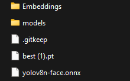
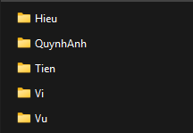
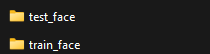
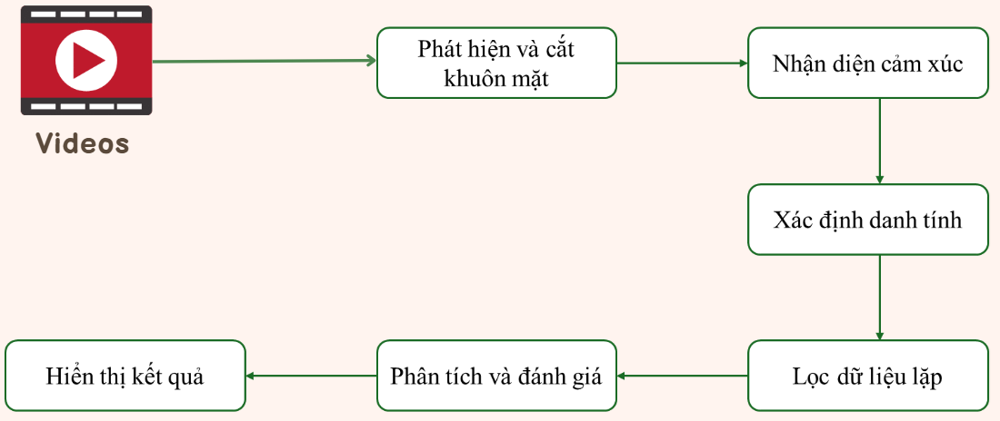

# smart_class

<a target="_blank" href="https://cookiecutter-data-science.drivendata.org/">
    
</a>

A short description of the project.

## Project Organization

```
├── LICENSE            <- Open-source license if one is chosen
├── Makefile           <- Makefile with convenience commands like `make data` or `make train`
├── README.md          <- The top-level README for developers using this project.
├── Models
│
├── Person              
│      
├── Videos   
│
├── Identity  
│                      
│
├── pyproject.toml     <- Project configuration file with package metadata for 
│                         src and configuration for tools like black
│
│
├── requirements.txt   <- The requirements file for reproducing the analysis environment, e.g.
│                         generated with `pip freeze > requirements.txt`
│
├── setup.cfg          <- Configuration file for flake8
│
└── src   <- Source code for use in this project.
    │
    ├── embedding_db.py            
    │
    ├── main_with_real_time.py               
    │
    ├── main_with_video.py              
    │
    └── ui_handler.py               
```

--------
# Hướng Dẫn Xây Dựng Hệ Thống Phân Tích & Đánh Giá Cảm Xúc Trong Môi Trường Giáo Dục Ứng Dụng Trí Tuệ Nhân Tạo

## Giới thiệu
- Trong xu thế phát triển giáo dục hiện đại, việc đảm bảo chất lượng giảng dạy và học tập là yếu tố then chốt để xây dựng nền tảng tri thức và kỹ năng. Tuy nhiên, các phương pháp đánh giá truyền thống thường thiếu tính khách quan, mất nhiều thời gian và khó theo dõi liên tục. Đề tài này hướng đến việc xây dựng một hệ thống phân tích và đánh giá chất lượng trong môi trường giáo dục sử dụng công nghệ thị giác máy tính.
- Hệ thống ứng dụng các kỹ thuật thị giác máy tính tiên tiến, bao gồm nhận diện hành vi, phân tích cảm xúc và theo dõi tương tác trong lớp học. Bằng cách sử dụng các mô hình học sâu, hệ thống tự động thu thập và phân tích dữ liệu về mức độ tập trung của học sinh, sự tương tác giữa giáo viên và học sinh, cũng như hiệu quả của các hoạt động học tập. Kết quả phân tích sẽ được tổng hợp thành các báo cáo chi tiết, giúp giáo viên và nhà quản lý giáo dục đưa ra các giải pháp cải thiện phương pháp giảng dạy và môi trường học tập.

## Công cụ và gói cần thiết
- Python 3.9(>3.9)
- PyTorch 
- Ultralytis
- Tensorflow
- CV2
- Numpy
- Matplotlib
- Deepface

- Tất cả nằm trong requirements.txt
## Hướng dẫn cấu hình các folder cần thiết
### Models

- Bạn có thể download Models ở đây[https://www.kaggle.com/datasets/giavi21/models-service-smartclass]
### Person

- Bạn có thể download Person ở đây[https://www.kaggle.com/datasets/giavi21/person-service-smartclass]
### Videos
- Bạn có thể download Videos ở đây[https://www.kaggle.com/datasets/giavi21/video-service-smartclass]
### Identity

- Bạn có thể download Identity ở đây[https://www.kaggle.com/datasets/giavi21/identity-service-smartclass]

## Quy trình hoạt động của hệ thống 


# Liên hệ
Nếu bạn có bất kỳ câu hỏi hoặc góp ý nào thì liên hệ với mình qua Email:[lehoanggiavi21082004@gmail.com], [quynhanhnguyenngoc081@gmail.com], [hoangvu26104@gmail.com]

# Liên kết hữu ích
- Bạn nên đọc các papers có trong folder Papers
- Deepface Doc[https://github.com/serengil/deepface]
- Pytorch Doc[https://docs.pytorch.org/docs/stable/index.html]
- Ultralytis Doc[https://docs.ultralytics.com/]

# Tác giả 
Được thực hiện bởi Lê Hoàng Gia Vĩ(Leader), Nguyễn Ngọc Quỳnh Anh và Hoàng Nguyên Vũ-Một nhóm sinh viên cùng chung đam mê và chí hướng, cùng đồng hành trên con đường chinh phục lĩnh vực Khoa Học Dữ Liệu và AI
